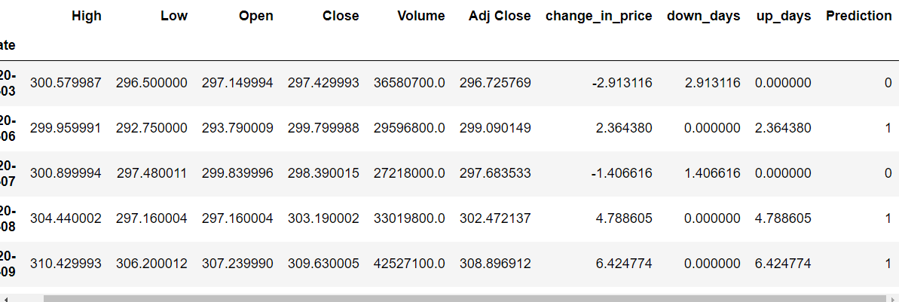
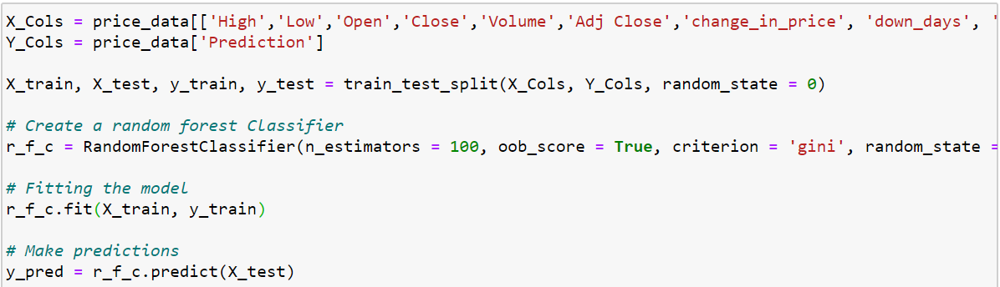
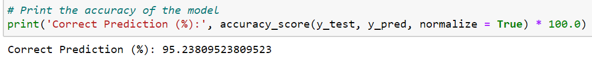
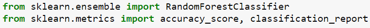
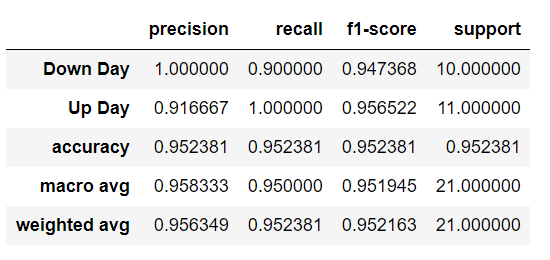
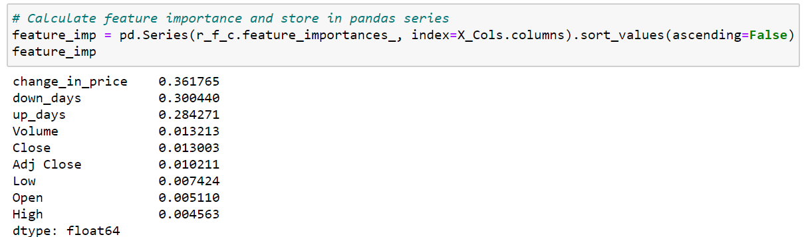
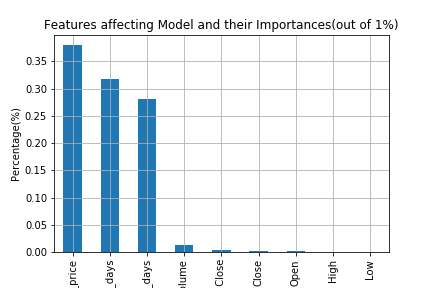

# Using Machine Learning to Predict Stock Price Trend 

A machine learning  algorithm Random Forest Classification was used in this model to determine the accuracy of the closing price trend of each day based on difference from day before. The stock used in this model was Apple from January 1st 2020 to May 1st 2020. After finding the accuracy of the model through the following dates, the inbuilt feature importance tool was also used to identify which features were driving the model to behave the way it was. The following were the steps taken to show what our model produced. 

### Dataframe Used:
So, the dataframe that was used is displayed below. 4 new columns were added which were 'change_in_price', 'down_days', 'up_days', and 'Prediction'. The 'change_in_price' shows the difference between the closing price for each day based on the previous. The 'down_days' and 'up_days' columns would be filled accordingly. If the difference between the previous day was positive, the 'up_days' column would be filled by that much amount of the difference. Whereas on a negative day, the 'down_days' column would be filled if only there was a negative difference in the closing price from before. If such is the case, the 'down_days' column would be filled by that much amount of difference except shown with a negative sign. Lastly, A prediction column was created. If the difference in closing price was an negative down day, the prediction column would be labeled with a 0. If the difference in closing price was a positive up day, the prediction column would be labeled with a 1. 

### Splitting the Data:
The data was then split into training and testing data with a random state of 0 and n_estimators of 100. The null values were dropped which were only the beginning of the new columns that I created since it could not read a difference from the very first column. The RandomForestClassifier was created, the model was fitted, and predictions were then made using the test set. 

### Finding Accuracy:
Accuracy is a measure of how our model is able to classify all testing samples correctly. So 95% is a pretty good accuracy score considering that we are only predicting the direction of the trend and not by how much. 

### Classification Report:
This is a metric that evaluates how well the model is performing. Precision provides us with insight into how well the predictions were calculated correctly for each target name. Based on the classification report, our model was 100% correctly able to predict a negative down day. On the other hand, it was 91.6% correctly able to predict a postive up day. 

### Finding Most Important Feature  
Random Forest has an inbuilt feature that allows the model to detect what is the most important feature impacting model performance. This helps us understand what features contribute most to the decision making in the model and help us better understand the drivers behind the model. In this model, the column 'change_in_price' is the most important feature in this model.

